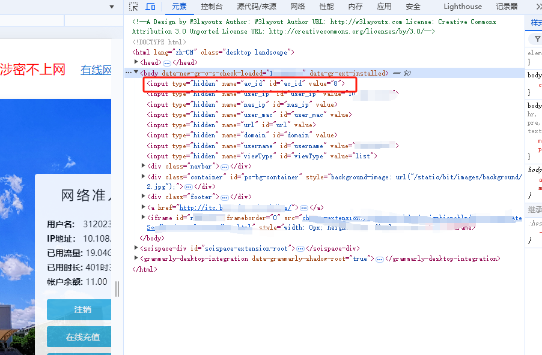
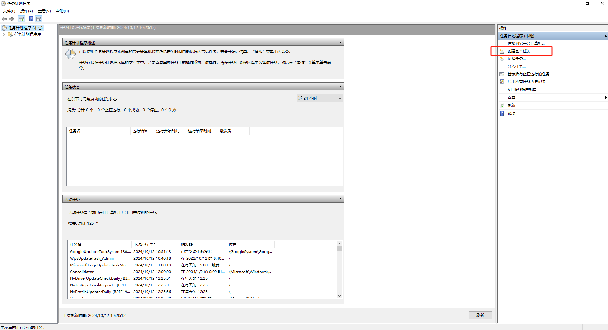
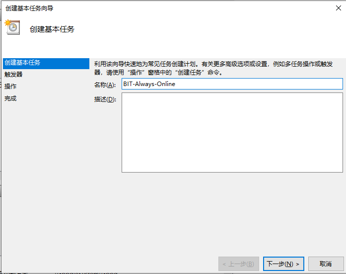
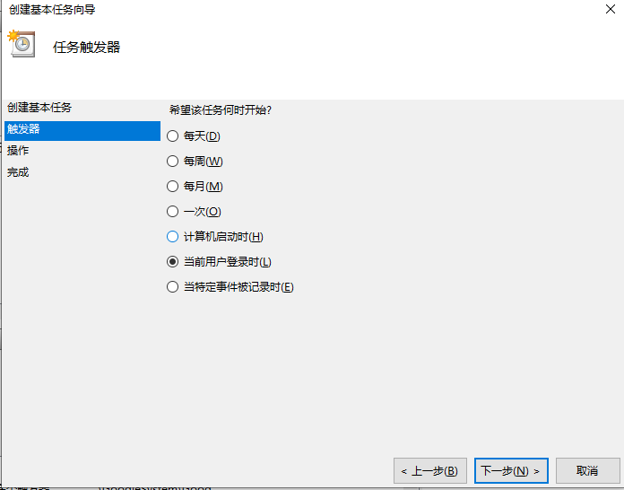
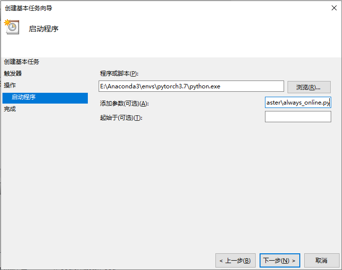
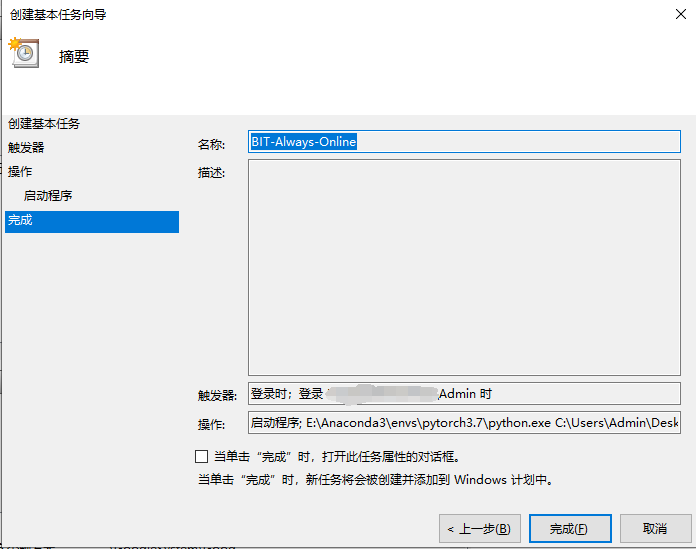

代码来源于https://github.com/coffeehat/BIT-srun-login-script，

在此基础上增加了**acid校正**和**Windows用户登录自启动脚本**两个说明模块


加密逻辑来自（目前404了）：https://coding.net/u/huxiaofan1223/p/jxnu_srun/git

另有支持多平台（包括openwrt）的golang版本，请见：https://github.com/Mmx233/BitSrunLoginGo

作者已经毕业，很难再更新代码了。如果校园网有变动，并且你有好的解决方案，还请提个pr哈。非常感谢~~ o(*￣▽￣*)ブ

# 概述

北京理工大学深澜校园网登录python脚本，可用于任何支持python的设备的网络命令行登录或命令行登录。

详细文档见：[深澜校园网登录的分析与python实现-北京理工大学版](https://zhuanlan.zhihu.com/p/122556315)

# 文件说明

|文件|说明|
|:-:|:-:|
|BitSrunLogin/|深澜登录函数包|
|demo.py|登录示例脚本|
|always_online.py|在线监测脚本，如果监测到掉线则自动重连|

always_online.py可采用`nohup`命令挂在后台：
``` bash
nohup python always_online.py &
```
# acid校正

文件BitSrunLogin\LoginManager.py中acid默认为1，但是根据测试发现并非所有用户的acid都为1。

应该是根据某个哈希映射将所有用户的acid其映射在一个小区间内，如1-10。

<u>如果此处acid与校园网的acid不一致，可能导致的问题是：校园网正常连接，但是网络不可用，不能正常打开网页等。</u>

```python
	def __init__(self,
		url_login_page = "http://10.0.0.55/srun_portal_pc?ac_id=8&theme=bit",
		url_get_challenge_api = "http://10.0.0.55/cgi-bin/get_challenge",
		url_login_api = "http://10.0.0.55/cgi-bin/srun_portal",
		n = "200",
		vtype = "1",
		acid = "1",
		enc = "srun_bx1"
	):
```

如何查看自己的acid：

1.在10.0.0.55注销校园网，将python代码中的acid设置为1

2.运行always_online.py脚本，连接上校园网。此时如果你不能正常打开其他网页，说明你的校园网acid不是1.

3.再次点开一个新的10.0.0.55网页，F12进入开发者模式，查看元素。如下图，可以看到自己的acid，我的是8。

4.将BitSrunLogin\LoginManager.py中的acid改为自己对应的值即可。



# Windows用户登录自启动脚本：

1. 打开**任务计划程序**，**创建基本任务**



2.填写触发器执行逻辑

名称：自定义英文名，如“BIT-Always-Online”

触发器：当前用户登录时

操作：启动程序

启动程序：**程序或脚本**栏填入python解释器路径，**添加参数**栏填写python脚本路径

完成：点击完成

完成后关机再重启电脑。








